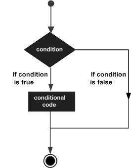

# intro
https://www.geeksforgeeks.org/golang-tutorial-learn-go-programming-language/
https://www.tutorialspoint.com/go/index.htm

- Initially developed at Google in the year 2007 by Robert Griesemer, Rob Pike, and Ken Thompson. But they launched it in 2009 as an open-source programming language.

- Is a statically typed and procedural programming language having syntax similar to C language. Go is a statically typed language, which means that the type of a variable must be declared before it can be used.Go is a statically typed language, which helps catch errors at compile time rather than at runtime.

- It provides:
  -  a rich standard library
  -  garbage collection : automatically manages memory for you.This eliminates the need for manual memory management, reducing the likelihood of memory leaks and other bugs that can arise from manual memory management.
  -  type safety
  -  dynamic-typing capability
  -  support for the environment to adopt patterns like dynamic languages. 

- The latest version of the Golang is 1.20.3 released on 4th April 2023.

- Programs are constructed using packages, for efficient management of dependencies. 

- Go programming implementations use a traditional compile and link model to generate executable binaries. 

# Why Golang?
The main purpose of designing Golang was to eliminate the problems of existing languages. 
So let us see the problems that we are facing with Python, Java, C/C++ programming languages:

- Python: It is easy to use but slow in comparison to Golang.
- Java: It has a very complex type system.
- C/C++: It has slow compilation time as well as a complex type system.

Also, all these languages were designed when multi-threading applications were rare, so not very effective to highly scalable, concurrent and parallel applications.
Threading consumes 1MB whereas Goroutine consumes 2KB of memory, hence at the same time, we can have millions of goroutine triggered.

# Features Excluded Intentionally
To keep the language simple and concise, the following features commonly available in other similar languages are omitted in Go:
- Support for type inheritance
- Support for method or operator overloading
- Support for circular dependencies among packages
- Support for pointer arithmetic
- Support for assertions
- Support for generic programming

# how to run
## Go Compiler
- The source code written in source file is the human readable source for your program.
  It needs to be compiled and turned into machine language so that your CPU can actually execute the program as per the instructions given. 
  
- The Go programming language compiler compiles the source code into its final executable program.

- Go distribution comes as a binary installable for FreeBSD (release 8 and above), Linux, Mac OS X (Snow Leopard and above), 
  and Windows operating systems with 32-bit (386) and 64-bit (amd64) x86 processor architectures.

- Ensure go is insalled.
  $ sudo apt update
  $ sudo apt install golang-go -y

- Verify the installation : $ go version

- Run the Go File : $ go run main.go

- Build and Run (Optional)
  To create a binary executable: 
   $ go build -o myapp main.go  # Build an executable file called myapp.
   $ ./myapp  # Runs the executable file.

# Syntax
- Check sample-code/1-basic-syntax.go

## line separator
- In a Go program, the line separator key is a statement terminator. That is, individual statements don't need a special separator like “;” in C.
- The Go compiler internally places “;” as the statement terminator to indicate the end of one logical entity.

# Identifiers

- In programming languages, identifiers are used for identification purposes. In other words, identifiers are the user-defined names of the program components. In the Go language, an identifier can be a variable name, function name, constant, statement label, package name, or type. 

Example:

package main
import "fmt"

func main() {

 var name = "GeeksforGeeks"
  
}

There is a total of three identifiers available in the above example:
 main: Name of the package
 main: Name of the function
 name: Name of the variable

- Check out rules for identifiers : https://www.geeksforgeeks.org/identifiers-in-go-language/?ref=next_article

- The identifier represented by the underscore character(_) is known as a blank identifier. 
  It is used as an anonymous placeholder instead of a regular identifier, and it has a special meaning in declarations, as an operand, and in assignments.

# blanks  - Unused meodules and variables
=> Go compiler raises an error whenever there's imported package or a created variable that is not used anywhere.

=> But many a times you will build a code with an end game in mind..You will declare variables that won't be built immediately
  as you are testing..Or imported packages.

=> You get around that with _

import _ "math" 

or

import ( 
    "fmt"
    _ "math/rand"
) 

variables :

var names,countries string
   
_ = countries  // A way to go past the error, ./main.go:68:14: countries declared but not used
   
fmt.Println("#### ===> Creating a string")
names = "Allan Maseghe"

# importing external Identifiers from a package/file

## overview
- The identifier which is allowed to access it from another package is known as the exported identifier. The exported identifiers are those identifiers which obey the following conditions:

  1. The first character of the exported identifier’s name should be in the Unicode upper case letter.
  
  2. The identifier should be declared in the package block or be a variable, function, type, or method name within that package.

- package line at the top reffers to the directory which contains identities to be imported.

## how to?
- Run the following command in your project root directory to ensure it's a Go module:
   $ go mod init learning-golang
     go: creating new go.mod: module learning-golang
     go: to add module requirements and sums:
        go mod tidy
  
  This creates a file go.mod that includes your module path.
  
   module learning-golang

   go 1.18

- Your package should be inside your Go module directory
  NB : The import refferences the folder dir name and NOT the file where the code is written!

 $ tree
.
├── README.md
├── go.mod
├── main.go
├── mypackages
│   └── greetings
│       └── greetings.go
├── sample-code
│   └── 1-basic-syntax.go
└── theory
    └── introduction.md

4 directories, 6 files

3 directories, 6 files

-   Ensure that your main.go file imports the package correctly. 
    If your module is named myproject, you should import it like this:

package main 

import (
  "fmt"
  "learning-golang/mypackages/greetings"
)

var LocalGreeting = "Hello, local file greetings"

func main() { 

    fmt.Println(LocalGreeting)
	fmt.Println(greetings.AllanGreeting)
	fmt.Println(greetings.NancyGreeting)
	
}

# Data Types

## overview
https://www.geeksforgeeks.org/data-types-in-go/
- Data types specify the type of data that a valid Go variable can hold. 

- In Go language, the type is divided into four categories which are as follows:

 1. Basic type: These are further categorized into 3 sub-categories :
    a) - Numbers : Divided into 3 sub-categories
         i) Integers
         ii) Floating-Point Numbers
         iii) Complex numbers
    b) - strings
    c) - booleans
 2. Aggregate type: Array and structs come under this category.
 3. Reference type: Pointers, slices, maps, functions, and channels come under this category.
 4. Interface type

# variables
## overview
- A variable is nothing but a name given to a storage area that the programs can manipulate. 

- Each variable in Go has a specific type, which determines the size and layout of the variable's memory, 
  the range of values that can be stored within that memory, and the set of operations that can be applied to the variable.

- The name of a variable can be composed of letters, digits, and the underscore character. 
  It must begin with either a letter or an underscore. Upper and lowercase letters are distinct because Go is case-sensitive.

- Variables could be in-built types like :
  - byte
  - int
  - float32

or user defined like :
  - Enumeration
  - Pointer
  - Array
  - Structure
  - Union

## statically typed language
- This means that variable types are known at compile-time rather than at runtime, which helps catch type-related errors early in the development process. 
  In Go, once you declare a variable's type, it cannot change, enforcing strict type checking.

  For example :

  var name string = "John"  // 'name' is declared as a string
  name = 123                // This would result in a compile-time error

## variable definition
- tells the compiler where and how much storage to create for the variable. 
  A variable definition specifies a data type and contains a list of one or more variables of that type as follows:

  var <variable_list> <optional_data_type>;

- Some valid declarations are shown here −

var  i, j, k int;  // The statement “var i, j, k;” declares and defines the variables i, j and k; . This instructs the compiler to create variables named i, j, and k of type int.
var  c, ch byte;
var  f, salary float32;
d =  42;  // Variables can be initialized (assigned an initial value) in their declaration. The type of variable is automatically judged by the compiler based on the value passed to it. 
d = 3, f = 5;    // declaration of d and f. Here d and f are int 

- For definition without an initializer: variables with static storage duration are implicitly initialized with nil (all bytes have the value 0); the initial value of all other variables is zero value of their data type.

## static type declaration
- This means that variable types are known at compile-time rather than at runtime, which helps catch type-related errors early in the development process. 

## Dynamic type declaration / Type inference
- A dynamic type variable declaration requires the compiler to interpret the type of the variable based on the value passed to it. 
  The compiler does not require a variable to have type statically as a necessary requirement.

-  When you declare a variable with :=, Go automatically infers the type based on the assigned value:
   
   name := "John"  // Go infers 'name' as a string

- Despite this convenience, the type remains static once assigned, maintaining Go’s static typing rules. 
  This combination of static typing with type inference is one reason Go is both efficient and easy to work with.

# lvalues vs rvalues
There are two kinds of expressions in Go −

1. lvalue − Expressions that refer to a memory location is called "lvalue" expression. 
   An lvalue may appear as either the left-hand or right-hand side of an assignment.

   Variables are lvalues and so may appear on the left-hand side of an assignment.

   me = me

2. rvalue − The term rvalue refers to a data value that is stored at some address in memory. 
  An rvalue is an expression that cannot have a value assigned to it which means an rvalue may appear on the right- but not left-hand side of an assignment.

  Numeric literals are rvalues and so may not be assigned and can not appear on the left-hand side.

  The following statement is valid: 

  x = 20.0

  The following statement is not valid. It would generate compile-time error:

  10 = 20

# constants
- Constants refer to fixed values that the program may not alter during its execution. 
  These fixed values are also called literals.

- Constants can be of any of the basic data types like an integer constant, 
  a floating constant, a character constant, or a string literal. 
  There are also enumeration constants as well.

- Constants are treated just like regular variables except that their values cannot be modified after their definition

# integer literals
- In Go, integer literals are representations of integer values in the code. 
  They allow you to write numbers in different bases, including decimal, binary, octal, and hexadecimal.

- Types of Integer Literals

1. Decimal (Base 10)

The most common form, where the number is represented in base 10.
No prefix is required.
Example: 42, 123, 0

2. Binary (Base 2)

Represented with a 0b or 0B prefix.
Example: 0b1010 (binary for 10 in decimal)

3. Octal (Base 8)

Represented with a 0 prefix.
Example: 075 (octal for 61 in decimal)

4. Hexadecimal (Base 16)

Represented with a 0x or 0X prefix.
Uses digits 0-9 and letters A-F or a-f.
Example: 0x2A (hexadecimal for 42 in decimal)

# escape sequence

When certain characters are preceded by a backslash, they will have a special meaning in Go. 
These are known as Escape Sequence codes which are used to represent newline (\n), tab (\t), backspace, etc.

\\	\ character
\'	' character
\"	" character
\?	? character
\a	Alert or bell
\b	Backspace
\f	Form feed
\n	Newline
\r	Carriage return
\t	Horizontal tab
\v	Vertical tab
\ooo	Octal number of one to three digits
\xhh . . .	Hexadecimal number of one or more digits

example :

package main

import "fmt"

func main() {
   fmt.Printf("Hello\tWorld!")
}

# rune
https://www.geeksforgeeks.org/rune-in-golang/

# operators
Operators are the foundation of any programming language. Thus the functionality of the Go language is incomplete without the use of operators. Operators allow us to perform different kinds of operations on operands. In the Go language, operators Can be categorized based on their different functionality:

1. Arithmetic Operators : These are used to perform arithmetic/mathematical operations on operands in Go language
   - Addition: The ‘+’ operator adds two operands. For example, x+y.
   - Subtraction: The ‘-‘ operator subtracts two operands. For example, x-y.
   - Multiplication: The ‘*’ operator multiplies two operands. For example, x*y.
   - Division: The ‘/’ operator divides the first operand by the second. For example, x/y.
   - Modulus: The ‘%’ operator returns the remainder when the first operand is divided by the second. For example, x%y.

2. Relational Operators : Relational operators are used for the comparison of two values.
   - ‘=='(Equal To) operator checks whether the two given operands are equal or not. If so, it returns true. Otherwise, it returns false. For example, 5==5 will return true.
   - ‘!='(Not Equal To) operator checks whether the two given operands are equal or not. If not, it returns true. Otherwise, it returns false. It is the exact boolean complement of the ‘==’ operator. For example, 5!=5 will return false.
   - ‘>'(Greater Than)operator checks whether the first operand is greater than the second operand. If so, it returns true. Otherwise, it returns false. For example, 6>5 will return true.
   - ‘<‘(Less Than)operator checks whether the first operand is lesser than the second operand. If so, it returns true. Otherwise, it returns false. For example, 6<5 will return false.
   - ‘>='(Greater Than Equal To)operator checks whether the first operand is greater than or equal to the second operand. If so, it returns true. Otherwise, it returns false. For example, 5>=5 will return true.
   - ‘<='(Less Than Equal To)operator checks whether the first operand is lesser than or equal to the second operand. If so, it returns true. Otherwise, it returns false. For example, 5<=5 will also return true.
   
3. Logical Operators
4. Bitwise Operators
5. Assignment Operators
6. Misc Operators

# formatting
## Overview
In Golang, you can format strings and other data types using the fmt package, which provides a variety of verbs and options to control the output.

## Summary of common verbs
%v	Default format	             fmt.Sprintf("%v", 42)
%+v	Struct with field names	     fmt.Sprintf("%+v", struct{Name string}{Name: "Alice"})
%#v	Go-syntax representation	 fmt.Sprintf("%#v", struct{Name string}{Name: "Alice"})
%T	Type of the value	         fmt.Sprintf("%T", 42)
%d	Integer (decimal)	         fmt.Sprintf("%d", 42)
%f	Float	                     fmt.Sprintf("%f", 3.14)
%s	String	                     fmt.Sprintf("%s", "Golang")
%q	Quoted string	             fmt.Sprintf("%q", "Golang")
%p	Pointer	                     fmt.Sprintf("%p", &a)
%t	Boolean	                     fmt.Sprintf("%t", true)

## examples
%t: Prints true or false.

fmt.Printf("%t\n", true)   // true
fmt.Printf("%t\n", false)  // false

fmt.Printf("%v\n", 42)             // 42
fmt.Printf("%T\n", 42)             // int

# functions
func function_name(Parameter-list)(Return_type) {
    // function body...
}

## call function by value
func multiply(a, b int) int {
    a = a * 2 // modifying a inside the function
    return a * b
}

func main() {
    x := 5
    y := 10
    fmt.Printf("Before: x = %d, y = %d\n", x, y)
    result := multiply(x, y)
    fmt.Printf("multiplication: %d\n", result)
    fmt.Printf("After: x = %d, y = %d\n", x, y)
}

# decision making / control statements

## overview
Decision making structures require that the programmer specify one or more conditions to be evaluated or tested by the program, 
along with a statement or statements to be executed if the condition is determined to be true, and optionally, 
other statements to be executed if the condition is determined to be false.

Following is the general form of a typical decision making structure found in most of the programming languages:

## if statement
if(boolean_expression) {
   /* statement(s) will execute if the boolean expression is true */
}

## if..else statement
if(boolean_expression) {
   /* statement(s) will execute if the boolean expression is true */
} else {
   /* statement(s) will execute if the boolean expression is false */
}

## if...else if...else Statement
if(boolean_expression 1) {
   /* Executes when the boolean expression 1 is true */
} else if( boolean_expression 2) {
   /* Executes when the boolean expression 2 is true */
} else if( boolean_expression 3) {
   /* Executes when the boolean expression 3 is true */
} else {
   /* executes when the none of the above condition is true */
}

## switch statement
A switch statement allows a variable to be tested for equality against a list of values(called cases). 

switch(boolean-expression or integral type){
   case boolean-expression or integral type :
      statement(s);      
   case boolean-expression or integral type :
      statement(s); 
   
   /* you can have any number of case statements */
   default : /* Optional */
      statement(s);
}

- The expression used in a switch statement must have an integral or boolean expression, or be of a class type in which the class has a single conversion function to an integral or boolean value. If the expression is not passed then the default value is true.

- You can have any number of case statements within a switch. Each case is followed by the value to be compared to and a colon.

- The constant-expression for a case must be the same data type as the variable in the switch, and it must be a constant or a literal.

- When the variable being switched on is equal to a case, the statements following that case will execute. No break is needed in the case statement.

- A switch statement can have an optional default case, which must appear at the end of the switch. The default case can be used for performing a task when none of the cases is true. No break is needed in the default case.

